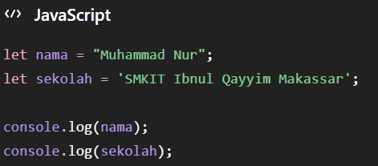
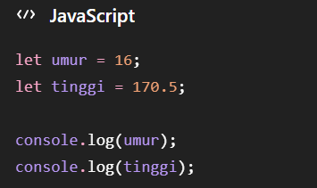
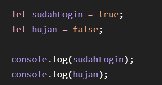
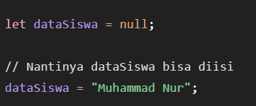
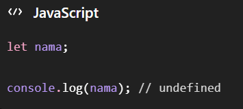
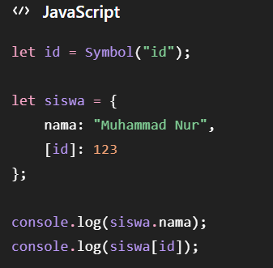
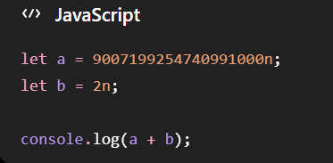

# Javascript-Fundamental

# 1. String
String digunakan untuk menyimpan teks atau kumpulan karakter. String ditulis menggunakan tanda kutip "...", '...', atau `...`. 

# 2. Number
Number digunakan untuk menyimpan angka, baik bilangan bulat maupun desimal. 

# 3. Boolean
Boolean hanya memiliki dua nilai, yaitu:
true → benar
false → salah
Biasanya digunakan untuk kondisi atau pengecekan.

# 4. Null
Null menunjukkan bahwa sebuah variabel sengaja tidak memiliki nilai atau nilainya dikosongkan.

# 5. Undefined
Undefined berarti sebuah variabel belum memiliki nilai.

# 6. Symbol
Symbol digunakan untuk membuat nilai yang unik dan tidak sama dengan Symbol lainnya. Biasanya digunakan sebagai identifier atau key yang unik pada object.

# 7. BigInt
BigInt digunakan untuk menyimpan bilangan bulat yang sangat besar, melebihi batas aman tipe Number.
BigInt dibuat dengan menambahkan huruf n di akhir angka.
